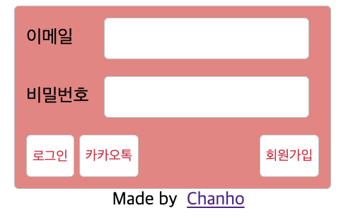
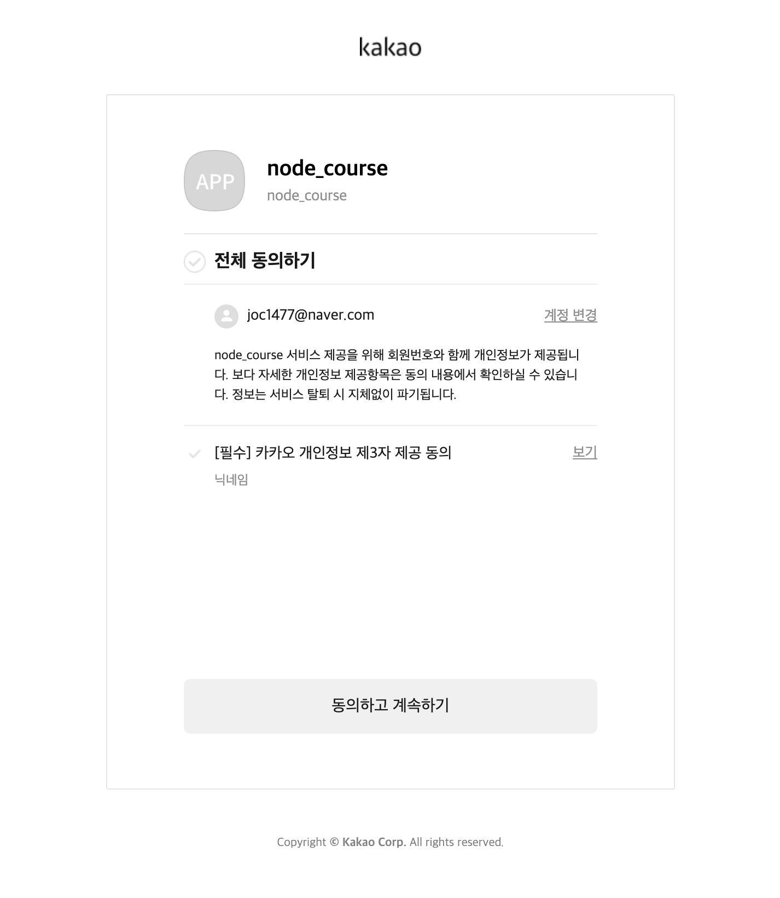
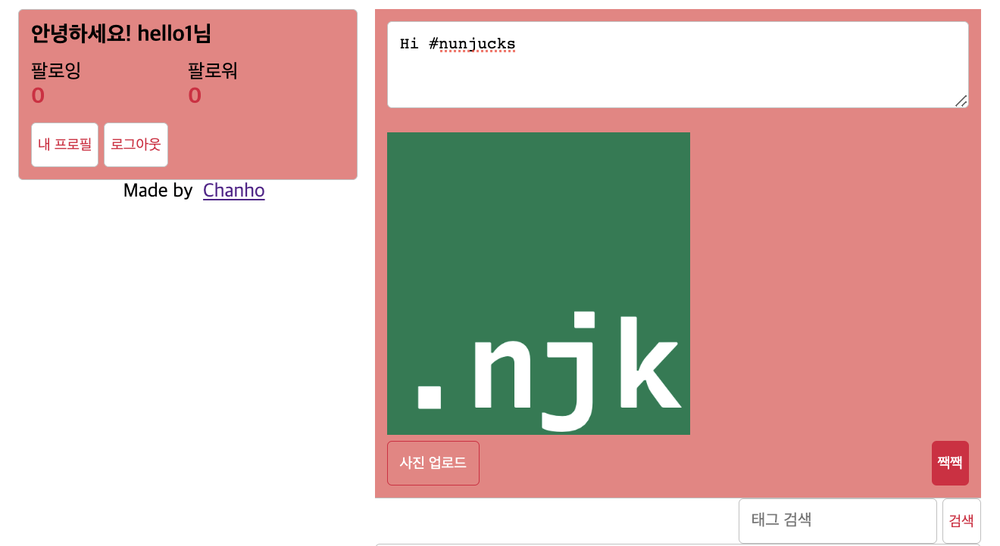
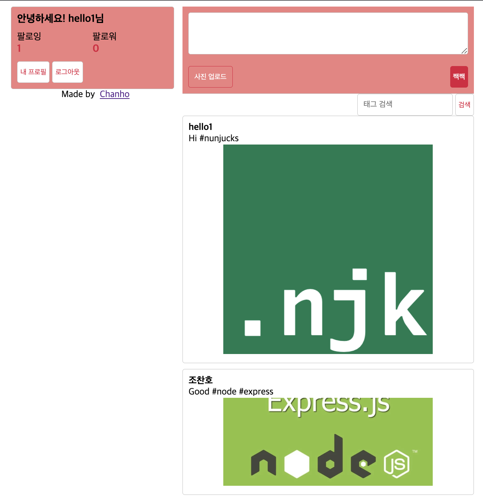
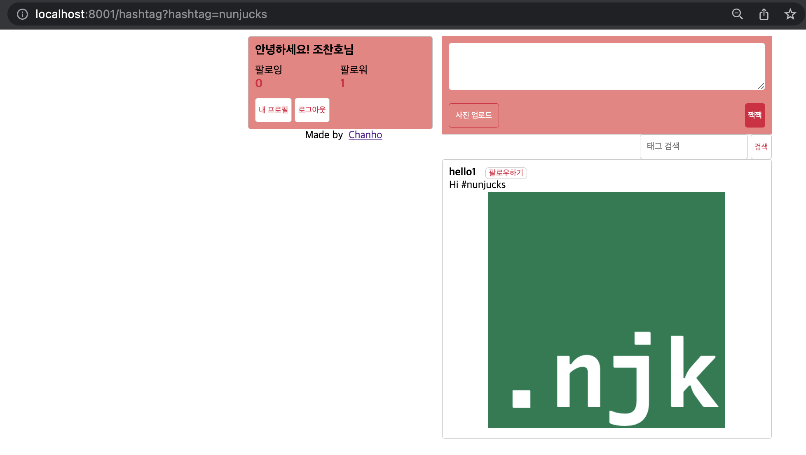

1.http_server

- node 내장기능을 이용한 server 생성
- http의 경우 도메인을 검색할때 뒤에 '80'을 생략 https의 경우 '443'을 생략이 가능하다.

  - 하나의 도메인 안에서 포트번호를 이용해 여러개의 프로그램을 동시에 연결 할 수 있다. \_ ( 다른 포트로 데이터 베이스나 다른 서버 동시에 연결 가능)

    2.REST_api

- REST API(Representational State Transfer)
  1. 서버의 자원을 정의하고 자원에 대한 주소를 지정하는 방법
  2. /user이면 사용자 정보에 관한 정보를 요청하는 것
  3. /post면 게시글에 관련된 자원을 요청하는 것
- HTTP 요청 메서드

  1. GET: 서버 자원을 가져오려고 할 때 사용
  2. POST: 서버에 자원을 새로 등록하고자 할 때 사용
  3. PUT: 서버에 자원을 요청에 들어 있는 자원으로 치환하고자 할 때 사용
  4. PATCH: 서버 자원의 일부만 수정하고자 할 때 사용
  5. DELETE: 서버의 자원을 삭제하고자 할 떄 사용
  6. OPTIONS: 요청을 하기 전에 통신 옵션을 설명하기 위해 사용한다.

  3.1.Cookie

- 쿠키: 키=값의 쌍 (name=chanho)
  1. 매 요청마다 서버에 동봉해서 보냄
  2. 서버는 쿠키를 읽어 누구인지 파악
- session 1. 쿠키의 정보는 노출되고 수정되는 위험이 있음, 중요한 정보는 서버에서 관리하고 클라이언트에서는 세션키만 제공
  3.2.https
- 웹 서버에 SSL 암호화를 추가하는 모듈 \_ 오고 가는 데이터를 암호화해서 중간에 다른 사람이 요청을 가로채더라도 내용을 확인할 수 없다.
- http2: SSL 암호화에 더불어 최신 HTTP 프로토콜인 http/2를 사용하는 모듈
  3.3.cluster
- 싱글 스레드인 노드가 CPU코어를 모두 사용할 수 있게 해주는 모듈
  1. 포트를 공유하는 노드 프로세스를 여러개 둘 수 있다.
  2. 요청이 많이 들어왔을 때 병렬로 실행된 서버의 개수만큼 요청이 분산된다.
  3. 서버에 무리가 덜간다.
  4. 단점: 컴퓨터 자원(메모리, 세션)등을 공유 못한다. // Redis등 별도 서버로 해결 가능

추가) Node Package Manager

- 공유된 코드를 사용하여 프로그래밍 가능, 오픈 생태계를 구성중
- 패키지: npm에 업로드된 노드모듈
- 모듈이 다른 모듈을 사용할 수 있듯 패키지도 다른 패키지를 사용가능, 의존 관계라 부른다.
- package.json
  1. scripts: 명령어를 축약해 놓을 수 있다. ex) "start": "node index" -> 터미널: npm run start -> index.js 실행
  2. dependencies: 사용하고 있는 패키지들을 기록 (버전을 함께 기록)
  3. devDependencies: 개발 할때만 사용하는 패키지들을 기록
- npm 명령어

  1. npm outdated: 어떤 패키지에 기능 변화가 생겼는지 알 수 있다.
  2. npm uninstall 패키지명: 패키지 삭제
  3. npm search 검색어: 패키지를 검색
  4. npm info 패키지명: 패키지의 세부 정보 파악가능
  5. npm adduser: npm에 로그인을 하기 위한 명령어
  6. npm whoami: 현재 사용가자 누구인지를 알려준다.
  7. npm logout: 로그인한 계정을 로그아웃
  8. npm version 버전: package.json의 버전을 올림

  4.learn-express

- node 프레임워크 \_ 코드 관리 용이
- nodemon: 파일 변경시 재시작 하여 반영해줌
- sendFile: express로 html서빙하기
- '\*' 애스터리스크를 이용해 모든 요청 처리 가능
  // get에 대한 모든 요청 처리 가능
  ```
  app.get('*', {req, res}=>{
    res.send('hello express');
  })
  ```
- MiddleWare: 공통되는 코드를 처리하여 중복 코드를 제거
  1. 미들웨어는 next()를 사용해야 다음 으로 넘어 갈 수 있다.
  2. 미들웨어 특성
  - 주소를 직접 정의해 줄 수 있다.
  - 여러 미들웨어를 연달아 사용 할 수 있다.
  ```
  app.use((req, res, next)=>{
    /// meddleware1
    next();
  }, (req, res, next)=>{
    /// meddleware2
    next();
  })
  ```
  3. 에러 미들웨어 생성
  - 반드시 4개의 모든 인자가 들어 있어야 한다.
  ```
   app.use((err, req, res, next)=>{
     console.error(err);
     res.send('에러발생');
   })
  ```
  4. 404처리 가능: 다른 라우터보다는 아래 에러미들웨어 보다는 위에 두어서 처리가능
- 요청 한번에는 응답은 한번만 가능 ( 아래 코드에서는 응답을 세번을 하려 하고 있으므로 에러 발생 )
  ```
  app.get('/', (res, req)=>{
    res.sendFile(path.join(__dirname, 'index.html'));
    res.send('hello');
    res.json({hello});
  })
  ```
- morgan: 클라이언트 요청을 서버에서 기록해주는 미들웨어
  1. combined: 사용시 더 자세한 정보를 기록
  2. 개발시에는 'dev'를 주로 사용
- cookieParser: 쿠키 생성 미들웨어
- static: 정적파일 제공 미들웨어 \_ 요청경로와 실제경로가 다르게 할 수 있어 보안 이점
- express-session: 요청마다 개인의 저장공간을 만들어주는 세션관리용 미들웨어
- multer: multipart/form-data인 경우 요청 본문을 해석하기 위해 사용하는 미들웨어
- dotenv: 환경변수를 관리 할 수 있는 라이브러리
- 템플릿 엔진: HTML의 정적인 단점을 개선 \_ PHP, JSP 유사
  1. 반복문, 조건문, 변수등을 사용할 수 있다.
  2. 동적인 페이지 작성 가능
- Pug(구 Jade)
  1. 익스프레스에서 app.set으로 퍼그 연결
  ```
  app.set('views', path.join(__dirname, 'views'));
  app.set('view engine', 'pug');
  ```
  2. pug는 닫는 태그가 없다. (코드량이 감소)
- 넌적스 템플릿 엔진

  1. 넌적스 연결

  ```
  app.set('vew engine', 'html');
  nunjucks.configure('views', {
    express: app,
    watch: true,
  })
  ```

  2. 넌적스는 HTML문법을 따른다.

  5.MySQL_Sequelize

- 데이터베이스: 관련성을 가지며 중복이 없는 데이터들의 집합
- 정보 <-컬럼, 실제 데이터 <- 로우
- 컬럼 옵션

  1. INT: 정수 자료형
  2. VARCHAR: 문자열 자료형
  3. TEXT: 긴 문자열 자료형
  4. DATETIME: 날짜 자료형 저장
  5. TINYINT: -128~127까지 저장, 주로 1 or 0만 저장해 불값 표현

  6. NOT NULL: 빈 값 불허 한다.
  7. AUTO_INCREMENT: 숫자 자료형인 경우 다음 로우가 저장될때
  8. UNSIGNED: 0과 양수만 허용
  9. ZEROFILL: 숫자의 자리 수가 고정된 경우 빈 자리에 0을 넣음
  10. DEFAULT now(): 날짜 컬럼의 기본값을 현재 시간으로

- 테이블 옵션
  1. COMMENT: 테이블에 대한 보충 설명
  2. DEFAULT CHARSET: utf8로 설정을 해야 한글 입력가능
  3. ENGINE: 엔진 선택
- MySQL 내에서 명령어
  1. 테이블 확인: DESC 테이블명
  2. 테이블 삭제: DROP TABLE 테이블명
  3. 테이블 생성: CREATE TABLE DB이름.테이블명
  4. 테이블 목록 보기: SHOW TABLES;
- 외래키(Foreign Key): 외래키를 두어 테이블간 관계가 있음을 표시
  1. ON DELETE CASCADE, ON UPDATE CASCADE
     : 로우가 지워지거나 수정될 때 관계 테이블의 연관된 로우도 지워지거나 수정된다.
- CRUD: Creeate, Read, Update, Delete
  1. CREATE: INSERT INTO 데이터베이스명.테이블명 (컬럼명...) VALUES (값...);
  2. READ: SELECT 컬럼 FROM 테이블명
     -WHERE로 조건 추가 가능
     -ORDER BY로 정렬가능: DESC*내림차순, ASC*오름차순
     -LIMIT: 조회할 개수 제한
     -OFFSET: 앞의 로우들 스킵 가능 (오프셋 만큼 건너뛰고)
  3. UPDATE: UPDATE 테이블명 SET 컬럼='바꿀 값' WHERE 조건
  4. DELETE: DELETE FROM 테이블명 WHERE 조건
- Sequelize 사용

  1. npx sequelize init: 시퀄라이즈 구조 생성
  2. sequelize.sync: MySQL 연결 \_ DB (만들어져 있어야함)
  3. npx sequelize db:create : config를 보고 db 생성

  6.Monfoose_MongoDB

- SQL & NoSQL

  1. SQL: 규칙에 맞는 데이터 입력, 데이블 간 join 지원, 안정성, 일관성, 용어(테이블, 로우, 컬럼)
  2. NoSQL: 자유로운 데이터 입력, 컬렉션 간 join 미지원, 확장성, 가용성, 용어(컬렉션, 다큐먼트, 필드)
     // JOIN? 관계가 있는 테이블끼리 데이터를 합치는 기능
  3. 실행확인 brew services llist
  4. 실행: brew services start mongodb-community
  5. 중지: brew services stop mongodb-community
  6. mongoDB 연결 및 사용 : mongoDB 실행후 mongosh
     use admin : 관리자 권한으로
     사용자 추가: db.createUser({user: '이름', pwd: '비밀번호', roles['root']})
  7. db확인: show dbs // 현재 db 확인: db
  8. db추가: use db명
  9. Collection 생성: db.createCollection('컬렉션명') \_ 로우를 추가 하면 자동생성 되기때문에 선택 사항
  10. Collection 확인: show collections
  11. mongoDB는 컬럼을 정의하지 않아도 된다.
  12. Read: db.컬렉션명.find({}) 모두 \_ findOne 하나만
      // 조건 추가: db.컬렉션명.find({}), { 조건 }
      // 정렬 sort, 갯수제한 limit, 오프셋 skip
  13. Update: db.컬렉션명.update ({조건}, {$set: {바꿀내용}}); // $set을 붙이지 않으면 필드 전체가 대체 된다.
  14. Delete: db.컬렉션명.remove({조건})

---

7.SNS_PJ

<p>이메일 로그인 및 카카오 로그인가능</p>

</img>

<p>첫 카카오 로그인시</p>



<p>게시글 작성</p>


<p>게시글</p>


<p>해쉬태그 검색</p>

