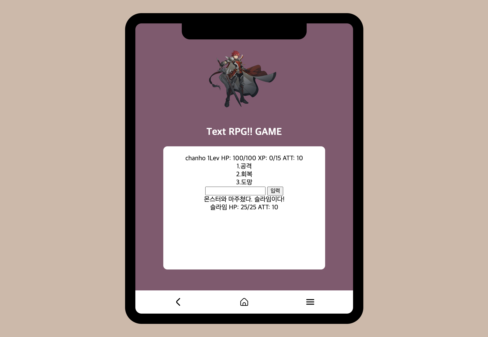
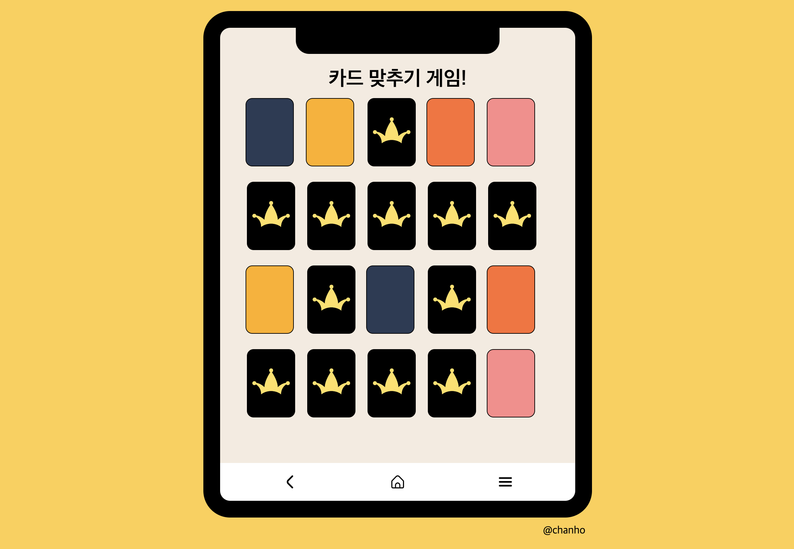
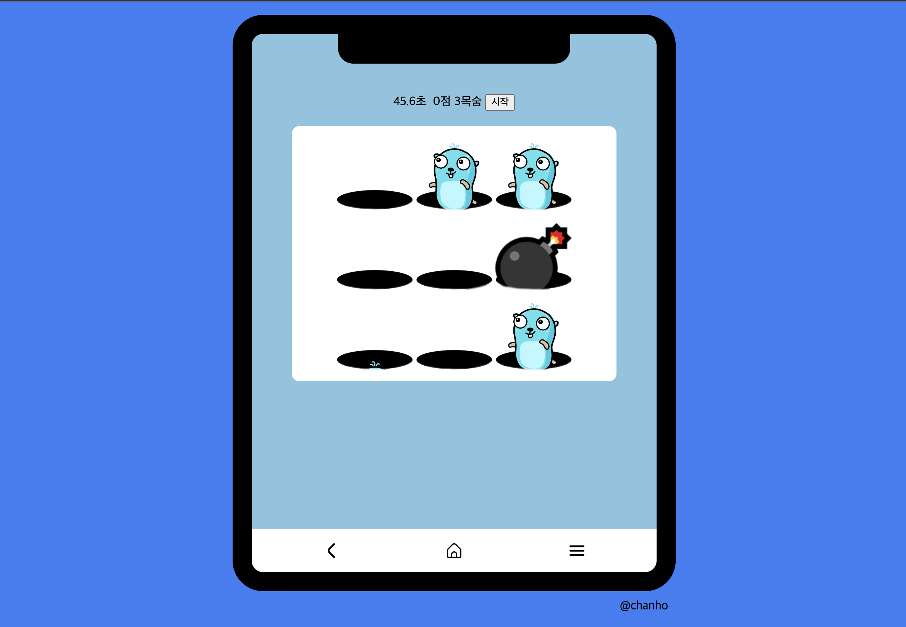

# <목차>

1. Vanilla Javascript로 만드는 웹 게임

<h1>📚 STACKS</h1>

 
   
   
   

 

# Learning 1 :: Vanilla Javascript로 만드는 웹 게임

## Preview & action

### main \_ 메인 페이지

 

### App1 \_ 끝말잇기 게임 & 쿵쿵따 게임

 

- 참여자 수를 결정한다.
- 첫번째 사람이 제시어를 말하면
- 다음 사람이 제시어 마지막 글자로 시작하는 글자를 말한다.
- 글자의 유효성을 체크 (이전 제시어의 마지막과 새로운 제시어의 첫번째 글자가 동일 한지,)
- (틀릴때 까지 반복)
- 오답일시 틀렸습니다. 출력
  +) 번외 \_ 쿵쿵따 게임 (글자수가 3글자이여야 한다.)

### App2 \_ 계산기

 

- 시작
- 숫자를 입력한다.
- 연산자를 입력한다.
- 숫자를 입력한다.
- '=' 버튼을 클릭한다.
- 계산한다.
- CheckProject: 연달아 계산하기 추가 ex) 1 + 2 + 3 = 6

### App3 \_ 숫자야구

 

1. 게임 방법

- 상대편이 숫자 1~9중에서 중복되지 않게 네개를 고른다.
- 10번의 기회동안 상대편이 고른 숫자 네 개를 맞히는 게임
  단, 숫자의 순서까지 맞혀야 한다.
- 틀릴 때마다 힌트를 준다.
- 맞힌 숫자의 개수, 순서 까지 맞힌 개수(스트라이크)를 알려준다.

ex) result: 3 1 4 6 -> 1 2 3 4 (3볼: 1,3,4 숫자는 맞았지만 자리는 틀림)
-> 3 5 6 7 (1스트라이크 1볼: 한개 숫자 자리를 맞고, 숫자는 맞았는데 자리가 틀림)
-> 2 5 8 9 (아웃) -> 3 1 4 6 (홈런)

### App4 \_ 로또 추첨기

 

1. 순서

- 1~45까지의 숫자를 준비
- 숫자를 섞는다.
- 공 7개를 뽑는다. (마지막 공은 보너스 공)
- 1초마다 공을 하나씩 화면에 표시

### App5 \_ 가위바위보 (컴퓨터와 가위바위보)

 

1. 동작

- 컴퓨터와 가위바위보를 하여 승리 점수를 기록한다.
- 컴퓨터는 가위,바위,보 를 빠르게(0.05sec) 순회 하며 돌아간다.
- 사용자가 버튼을 클릭하면 타이머가 1초동안 일시정지 한다.
- 사용자가 누른 버튼과 일시정지한 컴퓨터의 상태를 비교한다.
- 사용자 승리시 1점, 무승부 0점 비기면 -1점을 부여한다.
- (반복)

2. self-check

- 5판 3선승제 구현
- 무승부가 난 경우 무효
  +) 게임 종료시 가위바위보 화면 정지

### App6 \_ 클릭 반응속도 체크

 

1. 동작

- 처음화면 파랑 :: 대기화면
- 화면을 클릭하면 빨강화면 전환 :: 준비화면
- 임의의 시간이 지난 후 초록화면으로 자동 전환
- 초록화면으로 바뀐 뒤 클릭한 시간을 측정 하여 반환 (초록화면이 뜬 시간과 클릭한 시간의 차)
- 만약 빨강화면에서 클릭 시 성급했다는 메시지 나오고 대기화면으로 전환

2. self-check

- 가장 빠른 다섯 번의 시도가 몇초 인지를 보여라 ( 6번 이상의 시도한 경우 상위 5개만 보여준다.)

### App7 \_ 틱택토 게임

 

1. 동작

- 시작: 3*3 이차원 배열 준비 -> O의 턴으로 설정 -> 3*3 테이블을 그린다. (대기)
- 칸을 클릭 시
  1. 클릭한 칸이 비어 있지 않다면 대기, 비어있다면 현재 턴을 칸에 적어 넣음
  2. 승부 체크, 승부가 안났다면 턴을 넘긴다. 승부시 표시 끝

2. self-check

- 컴퓨터가 비어 있는 칸 중에 무작위로 X를 입력하게 한다.
- 컴퓨터 반응 속도 늦추기

### App8 \_ Text RPG

 

1. 동작

- 모드
  1. 모험, 휴식, 종류 중에서 선택하는 일반 모드
  2. 모험을 떠나서 적을 만나게 될 때 돌입하는 전투 모드
- 전투모드에서는 적을 공격하거나 체력을 회복하거나 도망간다.

2. self-check

- 휴식, 종료, 회복, 도망 기능 구현

### App9 \_ 카드 맞추기 게임

 

1.  동작

- 카드 랜덤 섞기
- 뒤집어 앞면을 보여준다.
- 다시 뒷면으로 뒤집는다.
  (대기)
  (카드 클릭)
- 카드를 뒤집고 클릭한 카드 배열에 추가
- 2장이 되면 두 카드가 같은지 확인
  1. 같으면 완료카드 배열에 삽입
  2. 다르면 1초 뒤에 두 카드를 뒷면으로 다시 뒤집는다.
- 모든 카드가 앞면이 되면, 축하 메세지를 띄우고 종료

2. self-check

- 몇 초 걸렸는지 확인하기
- 최대 20장의 카드를 만들 수 있게 수정.

### App10 \_ 지뢰찾기 게임

 

1. 동작

- 테이블 생성 및 지뢰 랜덤하게 심기
  (대기)
  (칸 좌클릭 시)
- 물음표 또는 깃발이 있으면 대기,
- 폭탄이라면 터지고 게임 종료
- 폭탄이 아니라면 카을 열고 주변 칸의 개수를 표시
  - 주변 칸 수가 0이라면 옆 칸을 열 수 있으면 연다.
- 모든 칸을 다 열었으면 이겼다고 표시 및 종료
  (칸 우클릭 시)
- 물음표 칸으로 전환
- 물음표 칸 이라면 깃발로 전환
- 깃발 칸이라면 닫힌 칸으로 전환

2. self-check

- 첫 번째 클릭한 칸은 지뢰가 없게 만들기

### App11 \_ 2048 게임

 

1. 동작

- 4\*4 테이블 생성
- 랜덤위치에 2 배치
  (대기)
  (마우스 또는 키보드 이벤트)
- 방향 판단
- 방향으로 숫자를 이동
- 방향으로 움직였을때 동일 숫자가 있는지 판단
- 동일 숫자이면 합쳐서 두배로 만든다.
  1. 2048 이라면 게임 종료
- 공간이 있다면 랜덤한 위치에 2를 생성
  1. 공간이 없다면 패배

2. self-check

- 되돌리기 기능 추가.

### App12 \_ 두더지 잡기 게임

 

1. 게임 동작

- 실시간으로 랜덤하게 튀어나오는 두더지를 사용자가 클릭하는 게임
- 랜덤하게 나오는 폭탄을 클릭시 목숨이 하나 감소
- 목숨은 3개가 주어지며 0이되면 게임 종료

2. self-check

- 목숨 구현하기

# Learning 2 :: React 로 만드는 웹 게임

- Learnig 1 에서 구현한 코드 리액트로 마이그레이션