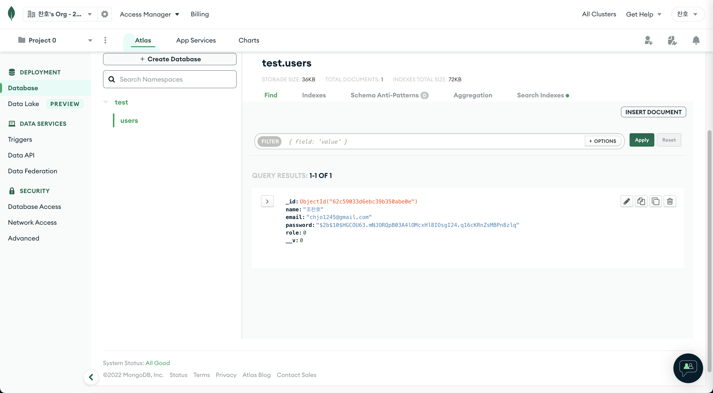

# Side Project :: 로그인 & 회원가입 풀스택 구현

## 프로젝트 소개

웹프로젝트에서 사용하기 위한 로그인 & 회원가입 기능의 Boiler Plate 구현
참조: inflean_John Ahn

## 기술 스택

<h1>📚 STACKS</h1>

  
  
  
  
  
   

## 프로젝트 실행

### boiler-plate

### `npm run dev` :: 서버및 클라이언트 동시 실행

### `npm run backend` :: 서버 실행

 

### boiler-plate/client

### `npm run start` :: 클라이언트 실행

 

## 구현기능

 

 

 

1. `서버 구축 데이터베이스 연동`
2. `회원가입 기능 구현` value작성 -> join -> mogodb 데이터 전송 (비밀번호 암호화)
3. `회원가입시 비밀번호 확인 기능` password와 Confirm password 다를시 alert
4. `로그인 기능 구현` 없는 이메일 혹은 다른 비밀번호 작성시 alert
5. `로그아웃 기능 구현` 로그인 상태가 아닐시 alert
6. `페이지 권한 부여` 유저상태가 로그인 인경우 loginpage, resgisterpage 접근 불가

---
